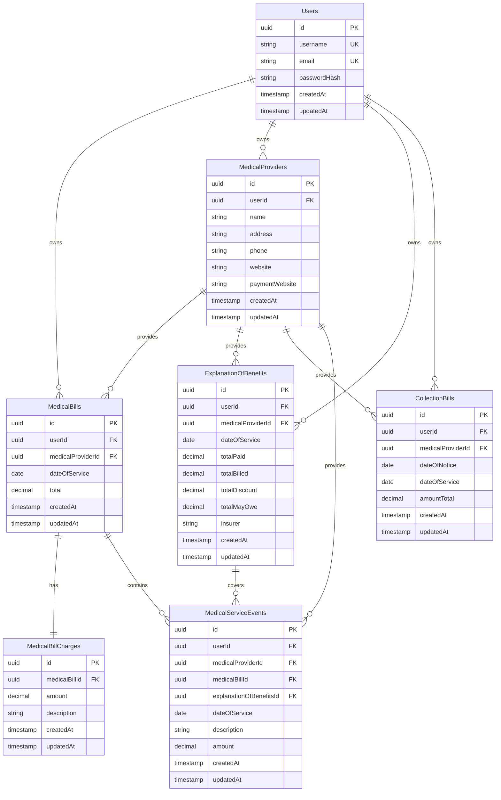
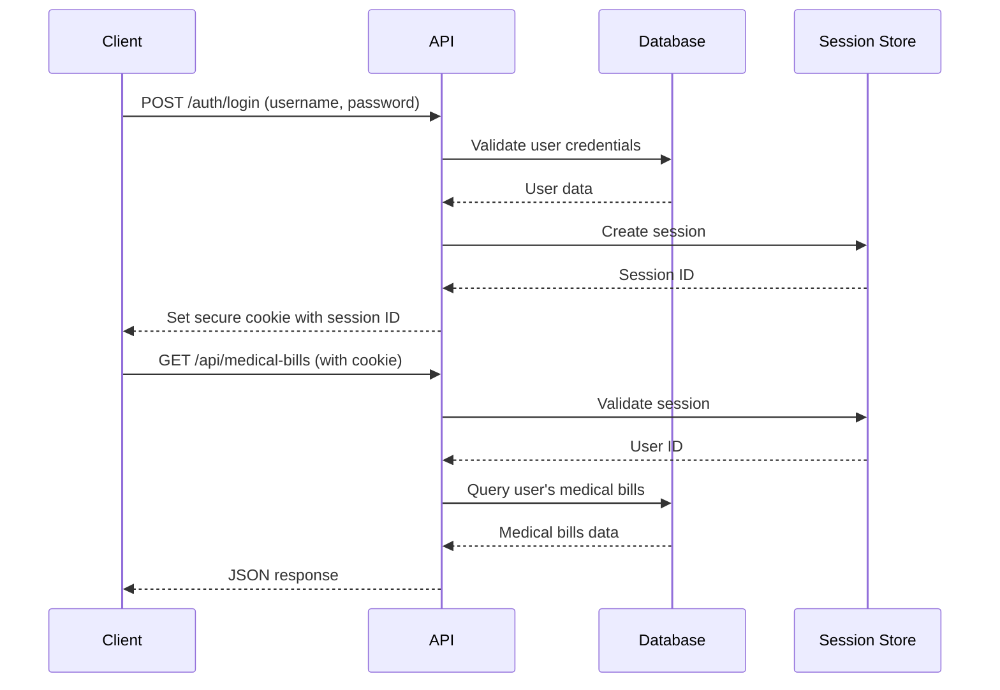

# Medical Bills Management System - Architecture Plan

## Project Overview
A TypeScript-based monorepo for managing medical bills, explanations of benefits, and related healthcare financial data with user authentication and multi-tenancy support.

## Technology Stack

### API (./api)
- **Runtime**: Node.js with TypeScript
- **Framework**: Express.js
- **Database**: Sequelize ORM with SQLite (local) / PostgreSQL (production)
- **Authentication**: Session-based with secure cookies
- **Testing**: Vitest for unit tests
- **Environment**: dotenv for configuration

### UI (./ui)
- **Framework**: Vue.js 3 with TypeScript
- **Testing**: Cypress for end-to-end tests
- **Build Tool**: Vite
- **State Management**: Pinia (if needed)

## Project Structure

```
medibills/
├── package.json                 # Root workspace configuration
├── .env.example                # Environment template
├── README.md                   # Setup and development guide
├── ARCHITECTURE.md             # This file
├── api/                        # Express API
│   ├── package.json
│   ├── tsconfig.json
│   ├── .env
│   ├── src/
│   │   ├── app.ts              # Express app setup
│   │   ├── server.ts           # Server entry point
│   │   ├── config/
│   │   │   ├── database.ts     # Sequelize configuration
│   │   │   └── session.ts      # Session configuration
│   │   ├── models/             # Sequelize models
│   │   │   ├── index.ts        # Model associations
│   │   │   ├── User.ts
│   │   │   ├── MedicalProvider.ts
│   │   │   ├── MedicalBill.ts
│   │   │   ├── MedicalBillCharges.ts
│   │   │   ├── ExplanationOfBenefits.ts
│   │   │   ├── CollectionBill.ts
│   │   │   └── MedicalServiceEvent.ts
│   │   ├── middleware/
│   │   │   ├── auth.ts         # Authentication middleware
│   │   │   └── validation.ts   # Request validation
│   │   ├── routes/
│   │   │   ├── index.ts        # Route aggregation
│   │   │   ├── auth.ts         # Authentication routes
│   │   │   ├── users.ts        # User management
│   │   │   ├── medical-bills.ts
│   │   │   ├── medical-providers.ts
│   │   │   └── placeholders.ts # Placeholder endpoints
│   │   ├── services/           # Business logic
│   │   │   ├── authService.ts
│   │   │   ├── userService.ts
│   │   │   └── medicalBillService.ts
│   │   └── types/              # TypeScript type definitions
│   │       └── index.ts
│   ├── tests/                  # Vitest tests
│   │   ├── setup.ts
│   │   ├── models/
│   │   ├── routes/
│   │   └── services/
│   └── database.sqlite         # Local SQLite database
├── ui/                         # Vue.js frontend
│   ├── package.json
│   ├── tsconfig.json
│   ├── vite.config.ts
│   ├── cypress.config.ts
│   ├── src/
│   │   ├── main.ts             # Vue app entry
│   │   ├── App.vue             # Root component
│   │   ├── components/         # Vue components
│   │   │   ├── auth/
│   │   │   ├── medical-bills/
│   │   │   └── common/
│   │   ├── views/              # Page components
│   │   │   ├── Login.vue
│   │   │   ├── Dashboard.vue
│   │   │   └── MedicalBills.vue
│   │   ├── services/           # API service layer
│   │   │   ├── api.ts          # Base API client
│   │   │   ├── authService.ts
│   │   │   └── medicalBillService.ts
│   │   ├── router/             # Vue Router
│   │   │   └── index.ts
│   │   └── types/              # TypeScript types
│   │       └── index.ts
│   ├── cypress/                # E2E tests
│   │   ├── e2e/
│   │   ├── fixtures/
│   │   └── support/
│   └── public/                 # Static assets
└── scripts/                    # Development scripts
    ├── dev.sh                  # Start both API and UI
    └── setup.sh                # Initial project setup
```

## Database Schema

### Core Relationships


## Authentication Flow

### Session-Based Authentication


## API Endpoints

### Authentication
- `POST /auth/login` - User login
- `POST /auth/logout` - User logout
- `POST /auth/register` - User registration
- `GET /auth/me` - Get current user

### Core Resources (Full CRUD)
- `GET|POST /api/users` - User management
- `GET|POST|PUT|DELETE /api/medical-bills` - Medical bills
- `GET|POST|PUT|DELETE /api/medical-providers` - Medical providers

### Placeholder Endpoints
- `GET|POST /api/explanation-of-benefits` - EOB management
- `GET|POST /api/collection-bills` - Collection bills
- `GET|POST /api/medical-service-events` - Service events

## Security Considerations

### Data Isolation
- All models include `userId` foreign key
- Middleware enforces user-scoped queries
- No cross-user data access possible

### Session Security
- Secure, HTTP-only cookies
- CSRF protection
- Session expiration
- Secure cookie settings in production

### Input Validation
- Request validation middleware
- SQL injection prevention via Sequelize
- XSS protection

## Development Workflow

### Local Development
1. `npm run setup` - Install dependencies and setup database
2. `npm run dev` - Start both API and UI in development mode
3. `npm run test` - Run all tests
4. `npm run test:api` - Run API unit tests
5. `npm run test:ui` - Run UI E2E tests

### Environment Configuration
- `.env` files for environment-specific settings
- Database connection strings
- Session secrets
- CORS origins

## Deployment Considerations

### Database Migration
- SQLite for local development
- PostgreSQL for production
- Sequelize migrations for schema changes

### Environment Variables
- `NODE_ENV` - Environment (development/production)
- `DATABASE_URL` - Database connection string
- `SESSION_SECRET` - Session encryption key
- `CORS_ORIGIN` - Allowed frontend origins

This architecture provides a solid foundation for your medical bills management system with room for future enhancements and production deployment.